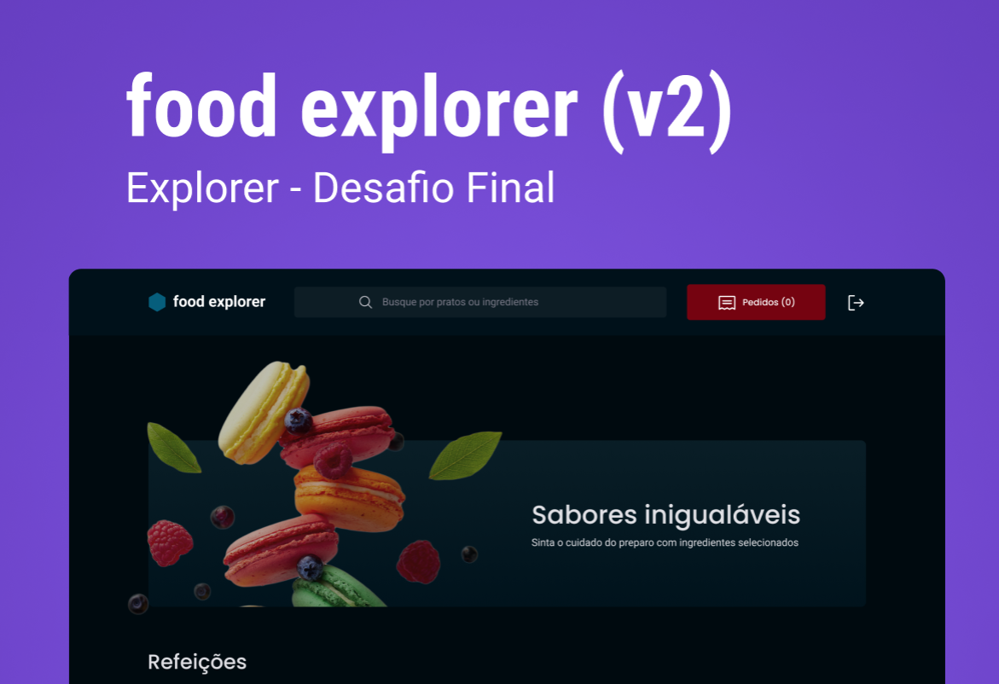

<p align="center">
  <a href="" rel="noopener">
 </a>
</p>

<h1 align="center">Food Explorer: Front-End</h1>

<div align="center">

[]() <br><br>
[Português](#pt) / [English](#en)
</div>

---
# Português <a name = "pt"></a>

## 📝 Tabela de conteúdos

- [Sobre](#about_pt)
- [Iniciando a aplicação](#getting_started_pt)
- [Estrutura do projeto](#project_structure_pt)
- [Deploy](#deployment_pt)
- [Usando](#usage_pt)
- [Tecnologias](#built_using_pt)

## 🧐 Sobre <a name = "about_pt"></a>
Esse projeto é o front-end do Food Explorer, um site de e-commerce focado em delivery. Sendo ele, o desafio final do curso Explorer da Rocketseat.<br>
Ele é uma interface web que consome a API desenvolvida para o projeto, que pode ser encontrada [aqui](https://github.com/LeonardoSPereira/FoodExplorerBackEnd)<br>
O projeto foi desenvolvido utilizando React.js, Styled Components e Vite, e permite que o usuário crie, leia, atualize e delete dados de usuários, produtos e pedidos.<br>
Ele possui um design no Figma, que pode ser encontrado [aqui](https://www.figma.com/community/file/1196874589259687769).<br>
O projeto foi construído utilizando o conceito de mobile first, e é responsivo.<br><br>
O projeto possui dois tipos de usuários: administradores e clientes. Os administradores podem criar, ler, atualizar e deletar produtos e pedidos, enquanto os clientes podem criar e ler pedidos.<br><br>
Para acessar a aplicação como administrador, utilize os seguintes dados:
```
email: admin@email.com
senha: admin@123
```
Para acessar a aplicação como cliente, basta criar uma conta utilizando o formulário de cadastro.

## 🏁 Iniciando a aplicação <a name = "getting_started_pt"></a>
Essas instruções vão te permitir obter uma cópia do projeto e rodar a aplicação localmente para propósitos de desenvolvimento e teste.

### Pre-requisitos
Para rodar a aplicação, você precisa ter o projeto do back-end rodando localmente. Para isso, siga as instruções [aqui](https://github.com/LeonardoSPereira/FoodExplorerBackEnd).<br>
Além disso, você precisará do Node.js instalado na sua máquina. Você pode baixá-lo [aqui](https://nodejs.org/).

### Instalação
Para acessar o projeto, basta clonar o repositório ou realizar o download dos arquivos do projeto.<br>
Para clonar o repositório, utilize o seguinte comando no seu terminal:

```sh
git clone https://github.com/LeonardoSPereira/FoodExplorerFrontEnd
```

Após clonar o repositório, acesse a pasta do projeto e instale as dependências utilizando o seguinte comando no seu terminal:

```sh
npm install
```

Após instalar as dependências, utilize o seguinte comando no seu terminal para iniciar a aplicação:

```sh
npm run dev
```
Com isso, a aplicação estará rodando em <code>http://localhost:5173</code>. Para acessar a aplicação, basta acessar esse endereço no seu navegador.

## 📁 Estrutura do projeto <a name = "project_structure_pt"></a>
A estrutura do projeto é a seguinte:

```
├── assets: pasta onde se encontram os arquivos de imagem utilizados no projeto.

├── src: pasta onde se encontram os arquivos da aplicação.

│   ├── components: pasta onde se encontram os componentes da aplicação, juntamente com os arquivos de estilização.

│   ├── hooks: pasta onde se encontram os hooks da aplicação, como o hook de autenticação e o hook do contexto do carrinho.

│   ├── pages: pasta onde se encontram as páginas da aplicação, juntamente com os arquivos de estilização.

│   ├── routes: pasta onde se encontram as rotas da aplicação, onde são divididas as rotas de autenticação e de administrador e de clientes.

│   ├── services: pasta onde se encontram os arquivos de configuração do axios, que é utilizado para realizar as requisições à API.

│   ├── styles: pasta onde se encontram os arquivos de estilização globais da aplicação e o arquivo de temas utilizado.

│   └── main.jsx: arquivo principal da aplicação.
```

## 🚀 Deploy <a name = "deployment_pt"></a>
O deploy da aplicação foi realizado utilizando a plataforma Vercel. Que garante que a aplicação esteja sempre rodando na última versão do projeto, de forma estável e segura.<br>
A aplicação pode ser acessada [aqui](https://food-explorer-app.vercel.app/).
O deploy do back-end foi realizado utilizando o plano gratuito do Render e por isso, a aplicação pode demorar alguns segundos para iniciar devido ao plano gratuito do Render colocar a aplicação em modo de hibernação após 30 minutos de inatividade. 

## 🎈 Usando <a name="usage_pt"></a>
Para utilizar a aplicação, basta acessar o link do deploy da aplicação, que pode ser encontrado na seção de deploy desse documento.<br>
Assim como rodando localmente, conforme indicado na seção de instalação desse documento.<br><br>
A aplicação possui dois tipos de usuários: administradores e clientes. Os administradores podem realizar todas as operações de CRUD de produtos e pedidos, enquanto os clientes podem criar, favoritar e ler pedidos.<br><br>

Para acessar a aplicação como administrador, utilize os seguintes dados:
```
email: admin@email.com
senha: admin@123
```

Para acessar a aplicação como cliente, basta criar uma conta utilizando o formulário de cadastro.

## ⛏️ Tecnologias <a name = "built_using_pt"></a>
- [React.js](https://reactjs.org/) - Framework web.
- [Styled Components](https://styled-components.com/) - Biblioteca de estilização.
- [Vite](https://vitejs.dev/) - Bundler.
- [Radix UI](https://www.radix-ui.com/) - Biblioteca de componentes.
- [Embla Carousel](https://www.embla-carousel.com) - Biblioteca de carrossel.
- [React Icons](https://react-icons.github.io/react-icons/) - Biblioteca de ícones.
- [Axios](https://axios-http.com/) - Biblioteca de requisições HTTP.


---
# English <a name = "en"></a>

## 📝 Table of Contents <a name = "en"></a>
- [About](#about_en)
- [Getting Started](#getting_started_en)
- [Project Structure](#project_structure_en)
- [Deployment](#deployment_en)
- [Usage](#usage_en)
- [Technologies](#built_using_en)

## 🧐 About <a name = "about_en"></a>
This project is the front-end of Food Explorer, an e-commerce website focused on delivery. It is the final challenge of the Explorer course by Rocketseat.<br>
It is a web interface that consumes the API developed for the project, which can be found [here](https://github.com/LeonardoSPereira/FoodExplorerBackEnd)<br>
The project was developed using React.js, Styled Components, and Vite, allowing users to create, read, update, and delete user, product, and order data.<br>
It has a design in Figma, which can be found [here](https://www.figma.com/community/file/1196874589259687769).<br>
The project was built using the mobile-first concept and is responsive.<br><br>
The project has two types of users: administrators and customers. Administrators can create, read, update, and delete products and orders, while customers can create and read orders.<br><br>
To access the application as an administrator, use the following credentials:
```
email: admin@email.com
password: admin@123
```

To access the application as a customer, simply create an account using the registration form.

## 🏁 Getting Started <a name = "getting_started_en"></a>
These instructions will allow you to get a copy of the project and run the application locally for development and testing purposes.

### Prerequisites
To run the application, you need to have the backend project running locally. Follow the instructions [here](https://github.com/LeonardoSPereira/FoodExplorerBackEnd).<br>
In addition, you will need Node.js installed on your machine. You can download it [here](https://nodejs.org/).

### Installation
To access the project, either clone the repository or download the project files.<br>
To clone the repository, use the following command in your terminal:

```sh
git clone https://github.com/LeonardoSPereira/FoodExplorerFrontEnd
```

After cloning the repository, navigate to the project folder and install dependencies using the following command in your terminal:

```sh
npm install
```
After installing the dependencies, use the following command in your terminal to start the application:

```sh
npm run dev
```

This will run the application at <code>http://localhost:5173</code>. To access the application, simply open this address in your browser.

## 📁 Project Structure <a name = "project_structure_en"></a>
The project structure is as follows:

```
├── assets: folder where image files used in the project are located.

├── src: folder where application files are located.

│   ├── components: folder where application components are located, along with styling files.

│   ├── hooks: folder where application hooks are located, such as authentication and shopping cart context hooks.

│   ├── pages: folder where application pages are located, along with styling files.

│   ├── routes: folder where application routes are located, dividing authentication, administrator, and customer routes.

│   ├── services: folder where axios configuration files are located, used for making API requests.

│   ├── styles: folder where global styling files for the application and the theme file are located.

│   └── main.jsx: main file of the application.

```

## 🚀 Deployment <a name = "deployment_en"></a>
The application was deployed using the Vercel platform, ensuring that the application is always running the latest version of the project in a stable and secure manner.<br>
The application can be accessed [here](https://food-explorer-app.vercel.app/).
The back-end was deployed using the free Render plan. Therefore, the application may take a few seconds to start due to the Render free plan putting the application in hibernation mode after 30 minutes of inactivity.

## 🎈 Usage <a name="usage_en"></a>
To use the application, simply access the application's deployment link, which can be found in the deployment section of this document.<br>
Also, you can run it locally as indicated in the installation section of this document.<br><br>
The application has two types of users: administrators and customers. Administrators can perform all CRUD operations on products and orders, while customers can create, favorite, and read orders.<br><br>

To access the application as an administrator, use the following credentials:
```
email: admin@email.com
password: admin@123
```
To access the application as a customer, simply create an account using the registration form.

## ⛏️ Technologies <a name = "built_using_en"></a>
- [React.js](https://reactjs.org/) - Web framework.
- [Styled Components](https://styled-components.com/) - Styling library.
- [Vite](https://vitejs.dev/) - Bundler.
- [Radix UI](https://www.radix-ui.com/) - Component library.
- [Embla Carousel](https://www.embla-carousel.com) - Carousel library.
- [React Icons](https://react-icons.github.io/react-icons/) - Icon library.
- [Axios](https://axios-http.com/) - HTTP request library.